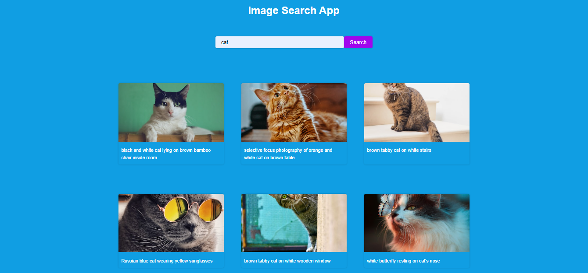

# image-search-app

## Description
The Image Search Web App that lets you search for any desired image. You can enter your search query and receive results accompanied by a description. The app is responsive and displays images in a single column on smaller ones. Using the Unsplash API, the app fetches up to 1000 unique and non-repetitive images. The modern CSS design ensures a fast and responsive user experience, making it enjoyable to search for cats, dogs, or any image.

## Prerequisites
N/A

## Technologies Used
Built with:
* HTML
* CSS
* JavaScript
* Unsplash API

## Installation
N/A

## Usage
N/A

## Project Link
Application can can be viewed here: 
* [Live](https://yvonnesarah.github.io/image-search-app/)

* [Repository](https://github.com/yvonnesarah/image-search-app)

## Screenshot(S)
Image Search App

Image Search App Example

## Credit
N/A

## Licence
Please refer to the LICENSE in the repo.