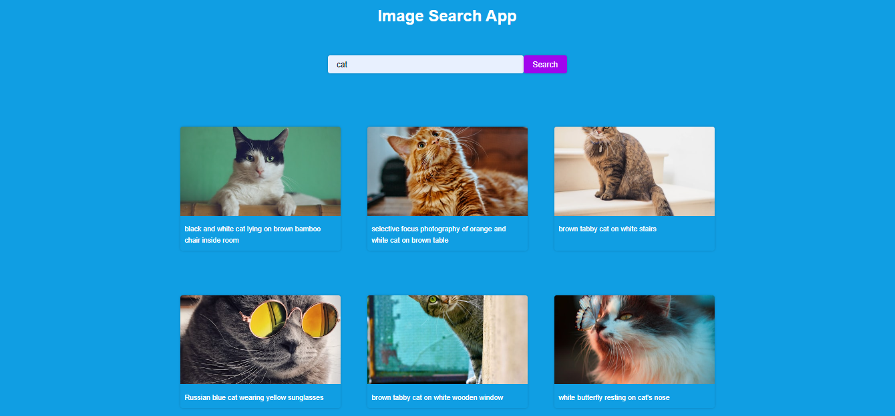

# image-search-app

## 📌 Description
The Image Search App allows users to search for images based on specific keywords. Using the Unsplash API, it fetches up to 1000 unique and high-quality images that are displayed along with descriptions. The app features a clean, modern design and is fully responsive, adjusting to mobile and desktop views. It's perfect for quickly searching for images of anything—cats, dogs, nature, or anything else you're curious about.

## 🛠 Prerequisites
Before running the app, ensure you have the following:
* A modern web browser (Chrome, Firefox, Safari, Edge)
* An Unsplash API key – You can get one by signing up at Unsplash Developer.
* Basic internet connection to fetch images from the API.

## 📋 Features
* Search Functionality: Search for images by entering any keyword.
* Grid Layout: View image results in a responsive grid format.
* Responsive Design: Optimized for mobile, tablet, and desktop devices.
* Image Descriptions: Each image includes a brief description from the Unsplash API.

## 💻 Technologies Used
This project was built using:
* HTML
* CSS
* JavaScript
* Unsplash API

## 🚀 Installation
No installation required. The app is live and can be accessed directly through the provided link. Simply open the live application in your browser.

## 📚 Usage
1. Open the Image Search App in your browser.
2. Enter a keyword in the search bar (e.g., "cats", "dogs", or "nature").
3. Press "Enter" or click the search button to fetch image results.
4. Browse through the images displayed in a clean, responsive grid layout.

## 🔗 Live Demo & Repository
Application can be viewed here:
* [Live](https://yvonnesarah.github.io/image-search-app/)

* [Repository](https://github.com/yvonnesarah/image-search-app)

## 🖼 Screenshot(S)
Image Search App

Image Search Example

## 🚀 Future Improvements
* 🔍 Advanced Search Filters – Filter images by orientation, color, or popularity.
* ⭐ Favorites Feature – Allow users to save favorite images for later.
* 📱 Enhanced Mobile Experience – Improve touch interactions and performance on smaller screens.
* 🌙 Dark Mode Toggle – Provide a dark/light theme for better accessibility.
* ⬇️ Download Option – Enable users to download images directly from the app.
* 📊 Pagination or Infinite Scroll – Load more images seamlessly as users scroll.

## 👥 Credit
Unsplash API for providing access to a vast collection of high-quality, royalty-free images.

## 📜 License
This project is open-source. For licensing details, please refer to the LICENSE file in the repository.

## 📬 Contact
You can reach me at 📧 yvonneadedeji.sarah@gmail.com.
